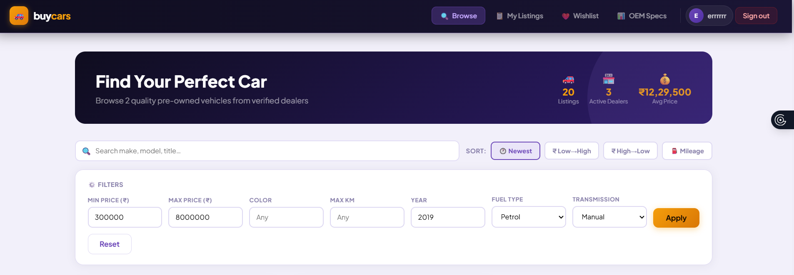
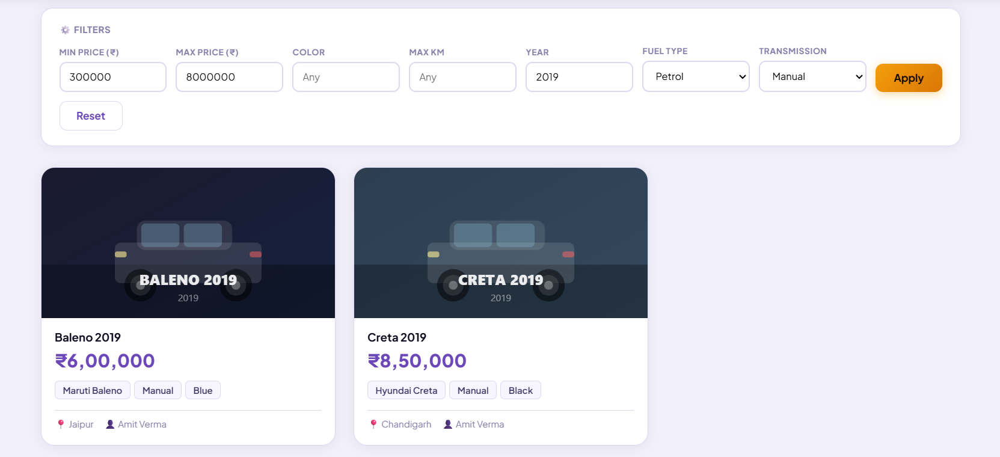
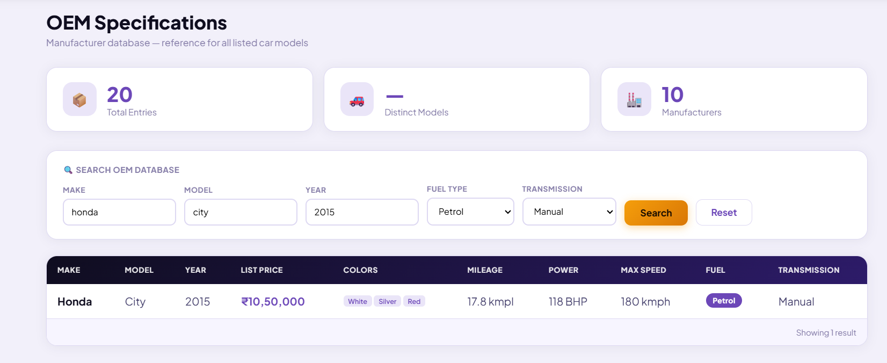

# 🚗 BuyCars — Used Car Marketplace

<p align="center">
  
  
  
  
</p>

<p align="center">
  A full-stack used car marketplace where dealers list vehicles, buyers browse and wishlist cars, and admins manage the platform — built with React + Flask + PostgreSQL + Redis + Sentry.
</p>

---

## 📌 Project Summary

BuyCars is a full-stack used car marketplace platform that enables dealers to list vehicles, users to browse and wishlist cars, and admins to manage the platform. It includes advanced search, filtering, caching, authentication, and real-time UI features.

---

## 🌐 Live Demo

- 🔗 Frontend: https://buycars-frontend.netlify.app
- 🔗 Backend API: https://buycars-2kvl.onrender.com

---

## 🚀 Highlights

- Built full-stack production-ready app (React + Flask + PostgreSQL)
- Implemented JWT authentication with refresh tokens
- Integrated Redis caching for performance optimization
- Designed scalable REST APIs with pagination & filtering
- Deployed on Render + Netlify with CI/CD pipeline

---

<<<<<<< HEAD
## 📸 Screenshots

### 🏠 Home / Login Page


### 🔍 Browse & Search


### 🚗 Search Results & Car Cards


### 🗄️ OEM Specifications


---

=======
>>>>>>> b62862f0f4b1c11f489a387988b48e988dda2181
## ⚡ Quick Start

```bash
git clone https://github.com/hemant7199/buycars.git
cd buycars

# Backend
cd backend
pip install -r requirements.txt
python app.py

# Frontend
cd ../frontend
npm install
npm run dev
```

---

## 🛠️ Tech Stack

<p align="center">
  
  
  
  
  
  
  
  
  
  
  
  
  
  
</p>

| Layer | Technology | Details |
|---|---|---|
| **Frontend** | React 18 + Vite 5 | SPA with Inter/Plus Jakarta Sans fonts, refined design system |
| **Backend** | Flask 3 + Gunicorn | REST API, JWT auth, rate limiting, structured logging |
| **Database** | PostgreSQL (prod) / SQLite (dev) | Auto-detected via `DATABASE_URL` env var |
| **Cache** | Redis (optional) | Search results, public stats, OEM data — graceful fallback |
| **Monitoring** | Sentry (optional) | Error tracking, performance traces, Flask integration |
| **Auth** | PyJWT | 1h access token + 30d refresh token |
| **Rate Limiting** | Flask-Limiter | Backed by Redis when available; memory otherwise |
| **CI/CD** | GitHub Actions | `pytest` + `vite build` on every push/PR |
| **Container** | Docker (multi-stage) | Node build stage → Python runtime stage |
| **Hosting** | Render Blueprint | One-click deploy via `render.yaml` |

---

## ✨ Features

### 🔐 Authentication
- JWT-based login and signup with hashed passwords (`werkzeug`)
- Dual token system — 1h access token + 30d refresh token
- Auto-refresh in the frontend before token expiry
- Role-based access: `dealer` and `admin`

### 🔍 Browse & Search
- Full-text search across listings with typeahead autocomplete and keyboard navigation
- Sort controls — Newest / Price ↑ / Price ↓ / Mileage (pill toggle UI)
- Filter by make, model, fuel type, transmission, price range, odometer
- Paginated results (12 per page)

### ❤️ Wishlist
- Save/remove cars from a personal wishlist
- Fast wishlisted-IDs endpoint for O(1) heart icon rendering
- Dedicated Wishlist page

### 📋 My Listings (Dealer)
- Add, edit, and delete own vehicle listings
- OEM spec picker pre-fills vehicle data from manufacturer database
- Bulk-delete support

### 🛡️ Admin Panel
- View all platform listings with pagination
- Platform-wide stats (total cars, users, avg price, etc.)
- Cache stats endpoint (`/api/cache/stats`) for Redis monitoring
- Admin role only

### 🗄️ OEM Specs
- Browse manufacturer specs for 12+ vehicle models across 7 brands
- Filter by make, model, fuel type, transmission
- Reference data for Honda, Maruti, Hyundai, Toyota, BMW, Tata, Mahindra, Volkswagen

### ⚡ Redis Caching
- Search results cached for 60s (configurable via `CACHE_TTL_SEARCH`)
- Public stats cached for 120s (`CACHE_TTL_STATS`)
- OEM spec data cached for 300s (`CACHE_TTL_OEM`)
- Cache automatically invalidated on any inventory write (add / edit / delete)
- Rate limiter also backed by Redis when available
- Fully optional — app runs normally without Redis (zero config change needed)

### 📡 Sentry Monitoring
- Automatic error capture with full stack traces
- Flask request/response lifecycle integration
- Performance tracing (20% sample rate) and profiling (10%)
- GDPR-safe: `send_default_pii=False`
- Environment tagging (development / production)
- Fully optional — set `SENTRY_DSN` to enable; leave blank to disable

### 🎨 UI Design (v5)
- Refined Inter + Plus Jakarta Sans typography
- New brand palette with deeper purples and sharper contrast
- Animated gradient button hover states
- Glass morphism utility class (`.glass`)
- Smoother card hover with spring-easing cubic-bezier
- Improved skeleton cards with realistic proportions
- Better toast notifications with gradient backgrounds and warning type
- Enhanced Nav bar with active state indicators and user avatar pill

### 🔒 Security
- HTML sanitization on all string inputs
- Controlled CORS via `ALLOWED_ORIGINS` env var (no wildcard `*` in production)
- Rate limiting on auth endpoints
- Structured logging with request/response tracking and login failure alerts

---

## 📁 Project Structure

```
buycars_v5/
├── backend/
│   ├── app.py                  # Flask app — all routes, config, DB, cache, Sentry
│   ├── requirements.txt        # Python dependencies (incl. redis, sentry-sdk)
│   └── tests/
│       └── test_app.py         # 44+ pytest tests
├── frontend/
│   ├── src/
│   │   ├── App.jsx             # Entire React SPA — upgraded design system
│   │   └── main.jsx            # React entry point
│   ├── index.html
│   ├── vite.config.js
│   ├── package.json
│   ├── .env                    # VITE_API_URL (local dev)
│   ├── .env.production
│   └── .env.example
├── .github/
│   └── workflows/
│       └── ci.yml              # GitHub Actions CI
├── schema.sql                  # DB schema + dummy seed data
├── Dockerfile                  # Multi-stage build (Node → Python)
├── render.yaml                 # Render one-click blueprint (incl. Redis)
├── Procfile                    # Gunicorn start command
├── .env.example                # Root env template (incl. REDIS_URL, SENTRY_DSN)
└── .dockerignore
```

---

## 🗃️ Database Schema

```
Users
├── user_id (PK)
├── name, email (UNIQUE), password_hash
├── role  → 'dealer' | 'admin'
└── created_at

OEM_Specs
├── oem_id (PK)
├── make, model, year  (UNIQUE together)
├── list_price, available_colors
├── mileage_kmpl, power_bhp, max_speed_kmph
├── fuel_type       → Petrol | Diesel | Electric | CNG | Hybrid
└── transmission    → Manual | Automatic | CVT | AMT | DCT

Marketplace_Inventory
├── inventory_id (PK)
├── dealer_id (FK → Users)
├── oem_id    (FK → OEM_Specs)
├── title, description, asking_price, color
├── odometer_km, major_scratches, original_paint
├── accidents_reported, previous_buyers
├── registration_place, image_url
└── listed_at

Wishlist
├── id (PK)
├── user_id   (FK → Users)
├── inventory_id (FK → Marketplace_Inventory)
├── added_at
└── UNIQUE(user_id, inventory_id)
```

> Indexes on `(make, model, year)`, `dealer_id`, `asking_price`, and `oem_id` for query performance.

---

## ⚡ Redis Cache — How It Works

```
GET /api/inventory?search=honda&sort=price_asc
        │
        ▼
  cache_get("inv:0:99999999:9999999:1:12:price_asc::::::::honda")
        │
   ┌────┴────┐
   │  HIT?   │──YES──► Return JSON from Redis (< 1ms)
   └────┬────┘
        │ NO
        ▼
   Query PostgreSQL
        │
        ▼
   cache_set(key, result, ttl=60s)
        │
        ▼
   Return JSON to client

POST/PUT/DELETE /api/inventory/*
        │
        ▼
   cache_delete_pattern("inv:*")    ← invalidate all search pages
   cache_delete_pattern("stats:*")  ← invalidate stats
```

**Cache keys used:**

| Pattern | Route | TTL |
|---|---|---|
| `inv:<params>` | `GET /api/inventory` | 60s (configurable) |
| `stats:public` | `GET /api/stats` | 120s (configurable) |
| `oem:all` | `GET /api/oem/all` | 300s (configurable) |

---

## 📡 Sentry — Setup in 2 Minutes

1. Go to [sentry.io](https://sentry.io) → Create a new **Python / Flask** project
2. Copy your **DSN** from Settings → Client Keys
3. Add to your `.env`:
   ```
   SENTRY_DSN=https://xxxx@oyyy.ingest.sentry.io/zzzz
   ```
4. That's it — errors, traces, and performance data appear in your Sentry dashboard automatically.

On Render, set `SENTRY_DSN` as an environment variable in the dashboard (marked `sync: false` in `render.yaml` so it's never committed to git).

---

## 🚀 Local Setup

### Prerequisites
- Python 3.11+
- Node.js 20+
- Redis (optional — `brew install redis` / `sudo apt install redis-server`)

### 1. Backend

```bash
cd backend
cp ../.env.example .env
# Edit .env: set SECRET_KEY
# Optionally set REDIS_URL=redis://localhost:6379/0
# Optionally set SENTRY_DSN=https://...
pip install -r requirements.txt
python app.py
# → http://localhost:5000
```

### 2. Frontend

```bash
cd frontend
cp .env.example .env
# Leave VITE_API_URL blank — Vite proxy routes /api → :5000
npm install
npm run dev
# → http://localhost:5173
```

### 3. Run Tests

```bash
cd backend
pytest tests/ -v
# 44+ tests — Redis and Sentry are auto-disabled in test mode
```

### 4. Docker

```bash
docker build --build-arg VITE_API_URL=http://localhost:5000 -t buycars .
docker run -p 5000:5000 \
  -e SECRET_KEY=mysecret \
  -e ENV=production \
  -e REDIS_URL=redis://host.docker.internal:6379/0 \
  buycars
```

---

## ☁️ Deploy to Render

`render.yaml` provisions everything in one click:

1. Push the repo to GitHub
2. Go to **Render → New → Blueprint** → connect your repo
3. Update `VITE_API_URL` in `render.yaml` to your actual backend URL
4. Set `SENTRY_DSN` manually in the Render dashboard after deploy
5. Click **Apply** — Render creates backend, frontend static site, PostgreSQL, and Redis

**Environment variables set automatically:**

| Variable | Source |
|---|---|
| `SECRET_KEY` | Auto-generated by Render |
| `DATABASE_URL` | Linked PostgreSQL connection string |
| `REDIS_URL` | Linked Redis connection string |
| `ALLOWED_ORIGINS` | Set to frontend URL |
| `PORT` | Assigned by Render |

**Set manually in Render dashboard:**

| Variable | Where to get it |
|---|---|
| `SENTRY_DSN` | sentry.io → your project → Settings → Client Keys |

---

## 🔌 API Reference

### Auth

| Method | Endpoint | Auth | Description |
|---|---|---|---|
| `POST` | `/api/auth/signup` | — | Register new dealer |
| `POST` | `/api/auth/login` | — | Login → access + refresh tokens |
| `POST` | `/api/auth/refresh` | — | Exchange refresh token for new access token |

### Inventory

| Method | Endpoint | Auth | Description |
|---|---|---|---|
| `GET` | `/api/inventory` | — | Browse listings (`?sort=&search=&page=`) · Redis cached |
| `POST` | `/api/inventory` | JWT | Add new listing · invalidates cache |
| `PUT` | `/api/inventory/:id` | JWT | Edit own listing · invalidates cache |
| `DELETE` | `/api/inventory/:id` | JWT | Delete own listing · invalidates cache |
| `POST` | `/api/inventory/bulk-delete` | JWT | Bulk delete · invalidates cache |

**Sort values:** `newest` · `price_asc` · `price_desc` · `mileage`

### OEM Specs

| Method | Endpoint | Auth | Description |
|---|---|---|---|
| `GET` | `/api/oem/all` | — | All manufacturer specs · Redis cached (5 min) |
| `GET` | `/api/oem/search` | — | Filter specs |
| `GET` | `/api/oem/count` | — | Total OEM record count |

### Wishlist

| Method | Endpoint | Auth | Description |
|---|---|---|---|
| `GET` | `/api/wishlist` | JWT | Get full wishlist |
| `GET` | `/api/wishlist/ids` | JWT | Get wishlisted IDs (fast, for UI hearts) |
| `POST` | `/api/wishlist/:id` | JWT | Add car to wishlist |
| `DELETE` | `/api/wishlist/:id` | JWT | Remove car from wishlist |

### Admin & Utility

| Method | Endpoint | Auth | Description |
|---|---|---|---|
| `GET` | `/api/admin/listings` | Admin JWT | All platform listings |
| `GET` | `/api/admin/stats` | Admin JWT | Platform statistics |
| `GET` | `/api/cache/stats` | Admin JWT | Redis memory and key stats |
| `GET` | `/api/stats` | — | Public stats · Redis cached (2 min) |
| `GET` | `/api/health` | — | Health check + DB type + cache status |

---

## 🔐 Demo Credentials

> Seeded automatically on first run via `schema.sql`.

| Email | Password | Role |
|---|---|---|
| `rajesh@dealer.com` | `password123` | dealer |
| `sunita@dealer.com` | `password123` | dealer |
| `amit@dealer.com` | `password123` | dealer |
| `admin@buycars.com` | `admin123` | **admin** |

---

## ⚙️ Environment Variables

Copy `.env.example` to `.env`:

```env
# Required
SECRET_KEY=your_very_secret_key_here

# Database (blank = SQLite for local dev)
DATABASE_URL=

# CORS
ALLOWED_ORIGINS=http://localhost:5173

# Flask
FLASK_ENV=development
FLASK_DEBUG=1

# Redis (optional — blank = no caching)
REDIS_URL=
# CACHE_TTL_SEARCH=60
# CACHE_TTL_STATS=120
# CACHE_TTL_OEM=300

# Sentry (optional — blank = no monitoring)
SENTRY_DSN=
```

---

## 📦 Dependencies

### Backend (`requirements.txt`)

| Package | Purpose |
|---|---|
| `flask>=3.0.0` | Web framework |
| `PyJWT>=2.8.0` | JWT token generation and verification |
| `werkzeug>=3.0.0` | Password hashing |
| `python-dotenv>=1.0.0` | `.env` file loading |
| `psycopg2-binary>=2.9.9` | PostgreSQL driver |
| `flask-limiter>=3.5.0` | Rate limiting (Redis-backed when available) |
| `gunicorn>=21.2.0` | Production WSGI server |
| `pytest>=8.0.0` | Test framework |
| `redis>=5.0.0` | Redis client for caching and rate limiter |
| `sentry-sdk[flask]>=1.40.0` | Error monitoring and performance tracing |

### Frontend (`package.json`)

| Package | Purpose |
|---|---|
| `react@^18.3.1` | UI library |
| `react-dom@^18.3.1` | DOM renderer |
| `vite@^5.4.2` | Build tool + dev server |
| `@vitejs/plugin-react@^4.3.1` | React fast-refresh in Vite |

---

## 🔄 CI/CD Pipeline

GitHub Actions on every push to `main`/`develop` and every PR to `main`:

```
push / PR
    │
    ├─── pytest (backend) ──────────────────────────────────────────┐
    │    Python 3.11 · pip install · TESTING=1 (disables Redis)     │
    │    pytest tests/ -v                                           │
    │                                                               ├── both must pass
    └─── Vite build (frontend) ─────────────────────────────────────┘
         Node 20 · npm ci · npm run build
```

---

## 🤝 Contributing

1. Fork the repository
2. Create a feature branch — `git checkout -b feature/your-feature`
3. Make changes and write/update tests
4. Run `pytest tests/ -v` — all tests must pass
5. Run `cd frontend && npm run build` — build must succeed
6. Open a Pull Request against `main`

---

## 📄 License

MIT License — free to use, modify, and distribute.

---

## 💼 What I Built

Developed a full-stack used car marketplace using React, Flask, and PostgreSQL with JWT authentication, Redis caching, and advanced search/filtering features. Deployed on Render and Netlify with CI/CD integration.

---

## 👤 Author

**Hemant**  
GitHub: https://github.com/hemant7199
